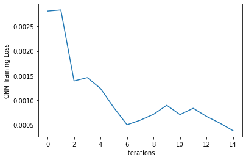

# Bridging Machine Learning and Logical Reasoning by Abductive Learning

Python implementation of [Abductive Learning](https://papers.nips.cc/paper/2019/file/9c19a2aa1d84e04b0bd4bc888792bd1e-Paper.pdf)

An explanation of the work done in this repository is in ABL_Vid.mkv

## Setup

Please run the code on Colab, some minor modifications need to be made if runnning locally. These modifications have been mentioned in the comments. Also, the output produced is more readable on Colab.

Please upload the file 'dataset.zip' to your Google Drive, inside a folder called AbductiveLearning.

Then, please mount your GDrive before executing. GPU runtime is recommended. The code takes a while to run (approx 1-2 hrs). 

If there is an unexpected result for any experiment, please try running the particular module once again. The model may have reached a bad local minima. The loss curves for each experiment are at the bottom of the output. They are also saved to Tensorboard

## Summary

Perception and reasoning are two representative abilities of intelligence that are
integrated seamlessly during human problem-solving processes. In the area of
artificial intelligence (AI), the two abilities are usually realised by machine learning
and logic programming, respectively.

Abductive learning is targeted at unifying the two AI paradigms in
a mutually beneficial way, where the machine learning model learns to perceive
primitive logic facts from data, while logical reasoning can exploit symbolic domain
knowledge and correct the wrongly perceived facts for improving the machine
learning models. 

The primary
difficulty lies in the fact that the sub-symbolic and symbolic models can hardly be trained together.
More concretely: 1) the machine learning model does not have any ground-truth of the labels for training 2) if the machine learning model does not predict the labels accurately, the reasoning model can hardly deduce the correct output or learn the right logical theory.

Given observed facts and background knowledge expressed as first-order logical clauses, logical abduction can abduce ground hypotheses as possible explanations to the observed facts. Thus, it can be used to guess the missing information, for example, logic clauses that complete the background knowledge, or the appropriate labels for the Machine Learning function. These labels can then be used to train the Machine Learning model.

Abductive Learning (ABL) tries to maximise the consistency between the abduced hypotheses
H with training data D = {<x1,y1>,<x2,y2>....<xN,yN>}, given background knowledge B. It can be defined as 

Con(H ∪ D; B)= max |Dc|, where Dc⊆D

s.t. ∀ <xi,yi>  ∈ Dc (B ∪ ∆ ∪ p(xi) |= yi).

where ∆ is a set of abduced logical clauses.

ABL needs to correct the wrongly perceived pseudo-labels to achieve consistent abductions,
such that ∆C can be consistent with as many as possible examples in D. Here we denote the
labels to be revised as δ[p(X)] ⊆ p(X), where δ is a heuristic function to estimate which
labels are perceived incorrectly. Then, logical abduction can be used to find a set of revised labels.

The algorithm used in Abductive Learning can be described as follows:

1. Initialize a Machine Learning Model p
2. For N epochs do:
3. Sample a batch D' from the Dataset D.
  4. Get a set of labels p(x) ∀ x 
  5. Use gradient-free optimization methods to find the set of labels to be revised
  6. Abduce a set of logical clauses ∆ and a set of revised labels ∆p, which maximize Con(Hδ ∪ D; B)
7. Retrain the Machine model on the updated labels.

## Modifications

The optimization module (step 5 in the algorithm above), is normally given the following constraint: |δ[p(X)]| ≤ M. In my implementation, I removed this constraint for the first iteration of the loop. This allows the model to reach a good starting point, from where it can iteratively improve quickly.

## Experiments

### Task 1: Handrittwen Equation Dicipherment

In this task, equations are constructed from images of symbols (“0”, “1”, “+” and “=”), and they are generated with unknown
operation rules, each example is associated with a label that indicates whether the equation is correct. A machine is tasked with learning from a training set of labelled equations, and the trained model is expected to predict unseen equations correctly. Thus, the machine needs to learn image recognition (perception) and mathematical operations for calculating the equations (reasoning) simultaneously. The images for "0"s and "1"s are taken from the MNIST dataset. 

### Task 2: Random Symbol Equation Dicipherment

In the earlier task, equations are created using images from the MNIST Images. While in this task, equations were constructed from randomly selected characters sets of the Omniglot dataset, i.e, a random Omniglot symbol is used to represent '1', '0', '+', '=' each.

We use a CNN as the Machine Learning model for these tasks.

## Ablation Experiments

### 1) Removing constraints from the optimization module

The optimization module (step 5 in the algorithm above), is normally given the following constraint: |δ[p(X)]| ≤ M. We try and see what happens when we remove this constraint.

### 2) Reducing the background knowledge available

### 3) Using greedy search for optimization

The original algorithm uses the POSS[2] algorithm for optimization. We try a simple greedy search in place of this.

We also compare the results of ABL, with a BiLSTM.

## Results

Firstly, we can see that in ABL the Machine Learning model's loss decreases during each iteration of the training process, as the logical module is able to abduce better hypothesis' each time as the ML model's predictions get closer to the actual labels.

The results over all experiments are tabulated below.

|                             Method |                    Task | Abduced Operator | Accuracy | F1-Score |
|-----------------------------------:|------------------------:|-----------------:|---------:|---------:|
|                                ABL |   Handwritten Equations |                6 | 0.890909 | 0.899148 |
|            ABL without constraints |   Handwritten Equations |               15 | 0.550000 | 0.650301 |
| ABL with less background knowledge |   Handwritten Equations |               -1 | 0.000000 | 0.000000 |
|  ABL with Greedy Search(50 iters)  |   Handwritten Equations |                9 | 0.601515 | 0.645910 |
|  ABL with Greedy Search(100 iters) | Handwritten Equations** |                9 | 0.831060 | 0.849260 |
|                             BiLSTM |   Handwritten Equations |               NA | 0.497727 | 0.562376 |
|                                ABL |Random Symbol Equations* |                6 | 0.929545 | 0.929755 |

*Best of 2 attempts
**This result is not there in the notebook, experiment was done seperately

The main observations from the table above are as follows:

1) ABL is able to learn the correct operator, and achieve good predictive accuracy, for both the handwritten equation and random symbol equation tasks. It is able to achieve this despite having seen very little data, and without consuming too much computational power.
2) ABL performs poorly when constraints are removed from the optimization module. As when constraints are removed, δ can simply mark all pseudo-labels as “wrong”, i.e., letting δ[p(X)] = p(X) and ask logical abduction to do all the learning jobs. In this case, ABL can always abduce a consistent ∆p ∪ ∆. However, this means that the logical abduction have to learn the knowledge model ∆ without any influence from the perception model p and the raw data X.
3) ABL performs poorly when background knowledge is reduced. This is because, in this case, the size of the search space increases from O(2^n) to O(4^n). It gets a 0% accuracy as it is unable to even learn the structure of the equation, and classifies each instance as invalid
4) ABL achieves good performance, though not as good as the original, when greedy search is used instead of POSS. However in this case, the optimization takes much longer time, and the loss fluctuates instead of monotonically decreasing. 
5) BiLSTM performs poorly on these tasks. It cannot do much better than random classification.

## Discussion

We have shown that Abductive Learning can be used to combine Machine Learning and Logical Reasoning in a mutually benefitial way. ABL utilises logical abduction and trial-and-error search to bridge machine learning with original first-order logic, without using gradient. As the result, ABL inherits the full power of first-order logical reasoning, e.g., it has the potential of abducing new first-order logical theories that are not in the background knowledge. Consequently, many existing symbolic AI techniques can be directly incorporated without any modification. It is also able to learn tasks from very few examples, and could be useful for few-shot learning tasks, especially when some background knowledge about the task can be given in the form of logical clauses.

This framework is general and flexible. For example, the perception machine learning model could be a pre-trained model rather than to be learned from scratch; The task for machine learning could be semi-supervised rather than having no label at all. 

### What inductive bias is needed to apply this technique?

The hypothesis space for ABL is (p ∪ ∆), where p is the function approximated by the machine learning algorithm and ∆ is the set of logically abduced clauses.

The inductive bias for this problem is maximum consistency score, i.e, when trying to choose among hypotheses, select the hypothesis with the highest consistency score. The machine learning algorithm p may have additional biases. For ex, in this case, the model is a CNN, which has a spatial bias. 

## Additional References (cited in Notebook)

1. Yu-Ren Liu, Yi-Qi Hu, Hong Qian, Yang Yu, Chao Qian. ZOOpt: Toolbox for Derivative-Free Optimization. CORR abs/1801.00329
2. Qian, C., Yu, Y., & Zhou, Z.H. (2015). Subset Selection by Pareto Optimization. In Advances in Neural Information Processing Systems. Curran Associates, Inc..
3. Yang Yu, Hong Qian, and Yi-Qi Hu. Derivative-Free Optimization via Classification. In: Proceedings of the 30th AAAI Conference on Artificial Intelligence (AAAI'16), Phoenix, AZ, 2016.
